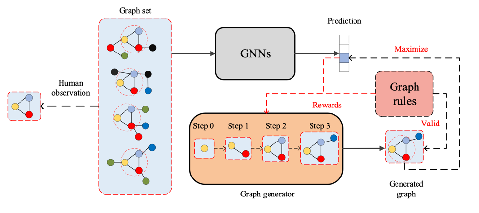

XGNN: Towards Model-Level Explanations of Graph Neural Networks

GNN模型级可解释-XGNN代码实现

[代码参考:可解释性研究（二）- XGNN](https://blog.csdn.net/qq_44370676/article/details/115872994?ops_request_misc=%257B%2522request%255Fid%2522%253A%2522163947121116780357234119%2522%252C%2522scm%2522%253A%252220140713.130102334..%2522%257D&request_id=163947121116780357234119&biz_id=0&utm_medium=distribute.pc_search_result.none-task-blog-2~all~baidu_landing_v2~default-3-115872994.pc_search_mgc_flag&utm_term=XGNN&spm=1018.2226.3001.4187 "XGNN")

[论文地址:XGNN: Towards Model-Level Explanations of Graph Neural Networks](https://arxiv.org/abs/2006.02587)

XGNN核心：

[MUTAG数据集下载](https://ls11-www.cs.uni-dortmund.de/people/morris/graphkerneldatasets/MUTAG.zip)

还分享了组会上的ppt，有需要可以取。